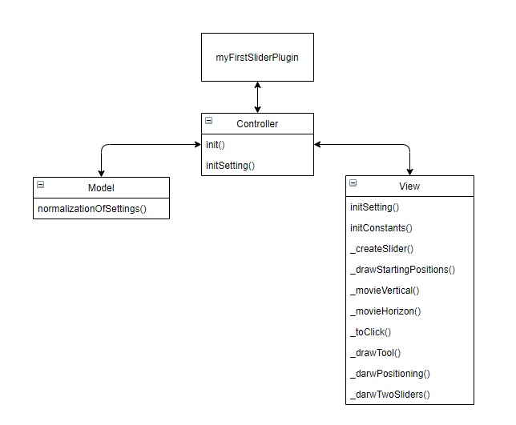

перед запуском нужно выполнить

1. npm install
2. npm run start запуск webpack-dev-server
3. npm run build создаст готовые файлы в папке dist
4. npm run karma запуск тестирования

папка с результатами тестов: coverage

Клонирование репозитория: git clone https://github.com/EvgeniyChuprov/sliderPlugin.git

[Github Pages site](https://evgeniychuprov.github.io/sliderPlugin/dist/)  
[Github Pages test](https://evgeniychuprov.github.io/sliderPlugin/coverage/html/)

# myFirstSliderPlugin

## Плагин построен по архитектуре MVC.

Состоит из 3 классов :

- Model - содержит в себе все параметры.
- View - отвечает за отрисовку слайдеров, их положения (вертикальное / горизонтальное), отображение тултипов.
- Controller - взаимодействует с Model и View. передает в Model параметры при инициализации плагина, а так же при изменении параметров пользователем.Так же Controller берет данные из Model и передает их в View для отрисовки плагина.

## UML диаграмма:

